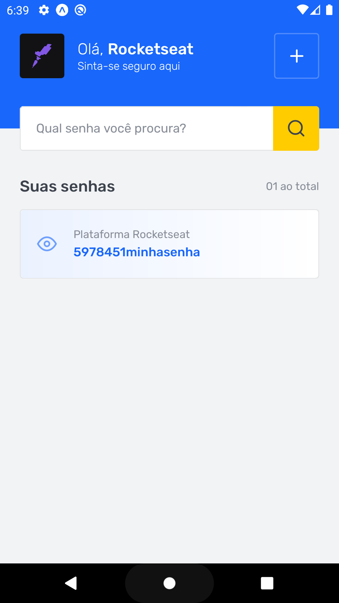
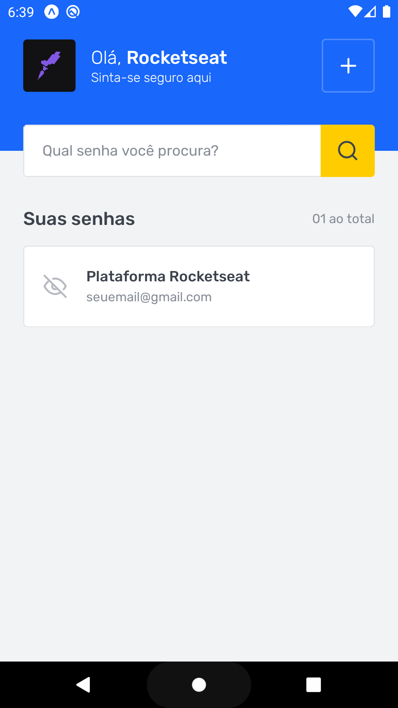

# 💻 Sobre o desafio

Nesse desafio, você irá implementar uma aplicação de gerenciamento de senhas: SavePass.

Essa aplicação possui duas telas, sendo a primeira delas uma listagem das senhas salvas e a segunda a tela de cadastro de novos logins.

Aqui você pode ver como ficará o aplicativo após todos os testes passarem: 

<h1 align="center">
  

    
    
    
  

</h1>

## Template da aplicação

Para realizar esse desafio, criamos para você esse modelo que você deve utilizar como um template do GitHub.

O template está disponível na seguinte URL: 

[Template](https://github.com/rocketseat-education/ignite-template-react-native-savepass)

<aside>

💡 **Dica**: Caso não saiba utilizar repositórios do GitHub como template, temos um guia em **[nosso FAQ](https://www.notion.so/FAQ-Desafios-ddd8fcdf2339436a816a0d9e45767664).**
</aside>

## O que devo editar na aplicação?

Com o template já clonado e as dependências instaladas, você deve completar onde não possui código com o código para atingir os objetivos de cada teste. Nesse desafio, você deve editar **apenas** os seguintes arquivos para completar as funcionalidades da aplicação:

- [src/screens/Home/index.tsx](https://github.com/rocketseat-education/ignite-template-react-native-savepass/blob/main/src/screens/Home/index.tsx);
- [src/screens/RegisterLoginData/index.tsx](https://github.com/rocketseat-education/ignite-template-react-native-savepass/blob/main/src/screens/RegisterLoginData/index.tsx);

Abaixo você vai ter duas formas de seguir o desafio:

1. Um guia do que você deve editar por arquivo (mais difícil);
2. Um guia do que você deve editar para implementar uma funcionalidade (mais fácil);

Então escolha o que preferir e bora pro desafio 🚀

[Guia por arquivo](porArquivo.md)

[Guia por funcionalidade](porFuncionalidade.md)

# Dicas do desafio

Se você leu a nossa doc e viu nosso vídeo de introdução, mas mesmo assim se sente travado na hora de resolver, que tal dar uma olhada nas dicas abaixo para te ajudar a resolver o desafio (com poucos spoilers, prometo 😉): 

[https://www.youtube.com/watch?v=yxGtz3EfSyU](https://www.youtube.com/watch?v=yxGtz3EfSyU)

# Solução do desafio

Caso você queira ver como resolver o desafio, fizemos um vídeo explicando o passo a passo para cumprir com todos os requisitos da aplicação:

[https://www.youtube.com/watch?v=7FIAffEJtaA](https://www.youtube.com/watch?v=7FIAffEJtaA)

## Especificação dos testes

Caso você esteja tendo dificuldade em algum teste específico, a seguir temos uma descrição mais detalhada do que cada teste espera que a aplicação faça para que ele passe.

<aside>

💡 Caso você tenha dúvidas quanto ao que são os testes, e como interpretá-los, dê uma olhada em **[nosso FAQ](https://www.notion.so/FAQ-Desafios-ddd8fcdf2339436a816a0d9e45767664)**

</aside>

[Especificação dos testes](https://www.notion.so/Especifica-o-dos-testes-12c4c3b92eca4810aa1449b764a174e9)

# 📅 Entrega

Esse desafio deve ser entregue a partir da plataforma da Rocketseat. Envie o link do repositório que você fez suas alterações. Após concluir o desafio, além de ter mandado o código para o GitHub, fazer um post no LinkedIn é uma boa forma de demonstrar seus conhecimentos e esforços para evoluir na sua carreira para oportunidades futuras.

Feito com 💜 por Rocketseat 👋 Participe da nossa [comunidade aberta!](https://discord.gg/pUU3CG4Z)